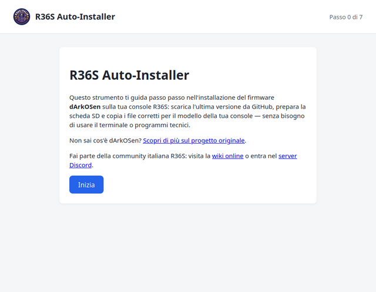
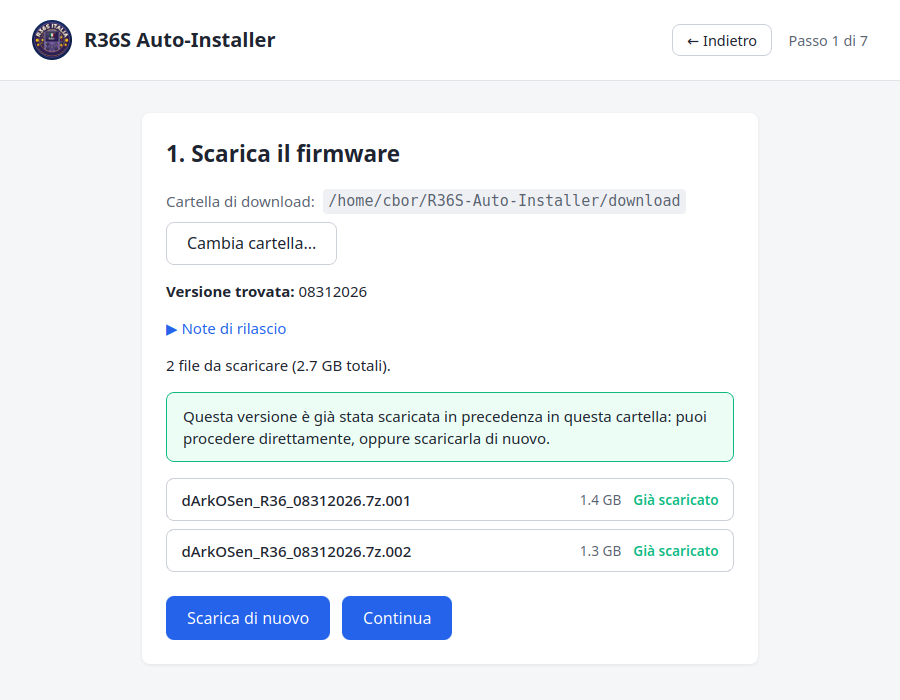
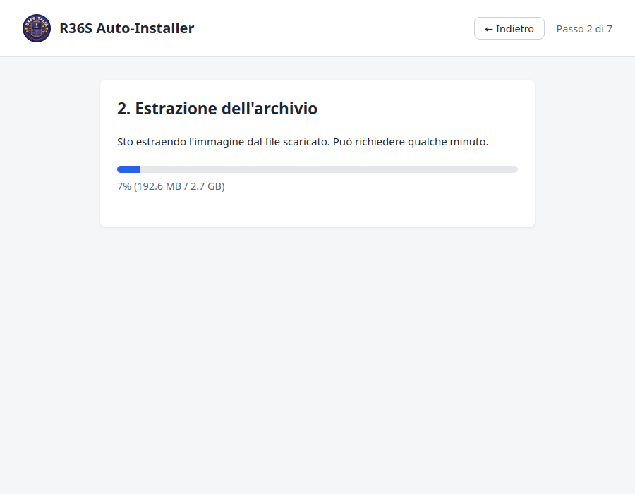
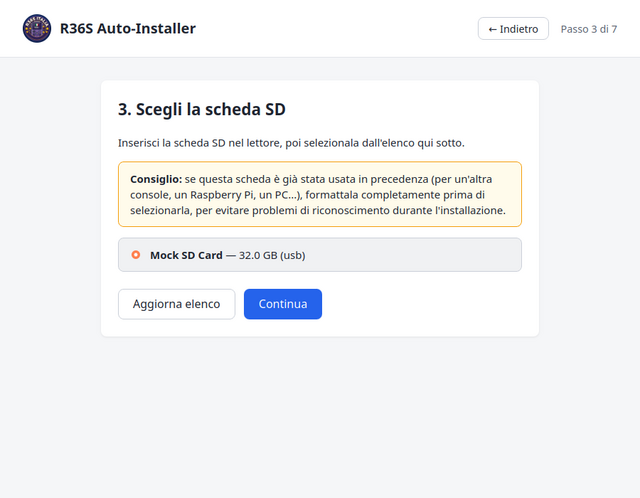
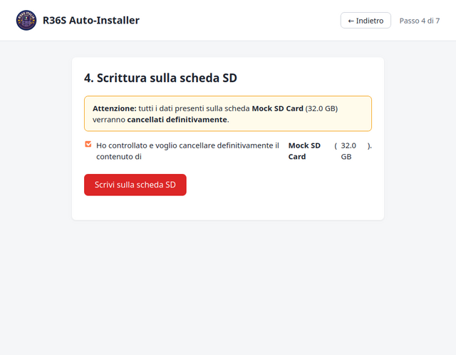
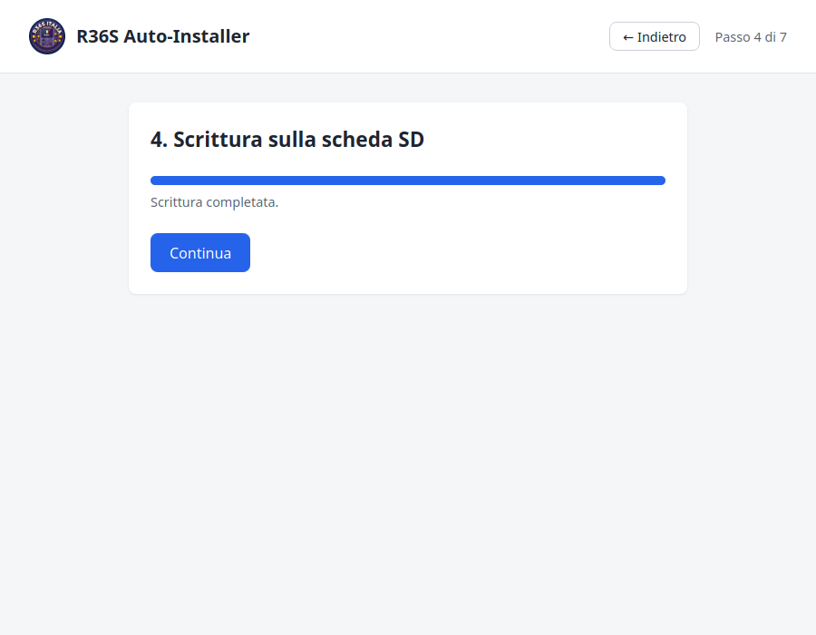
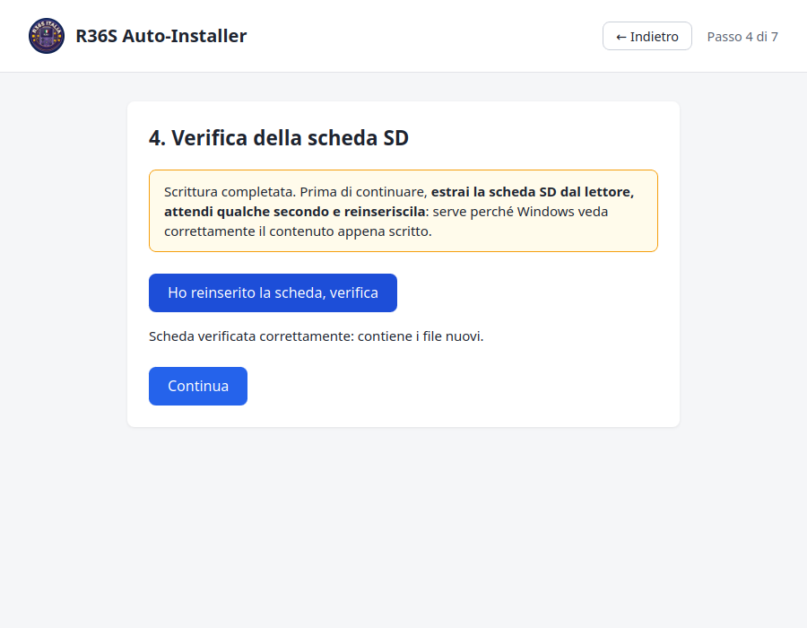
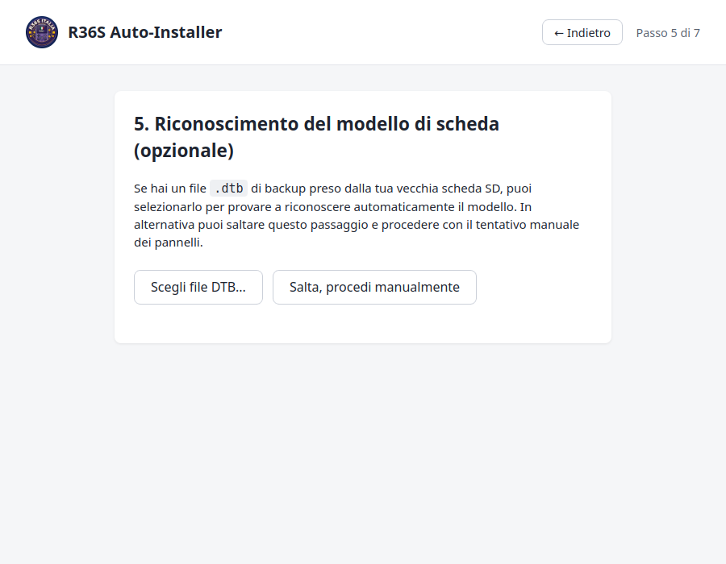
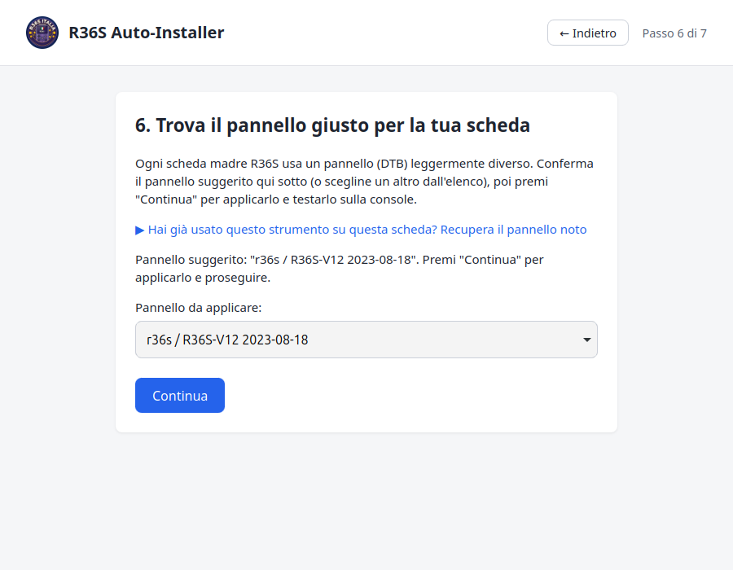
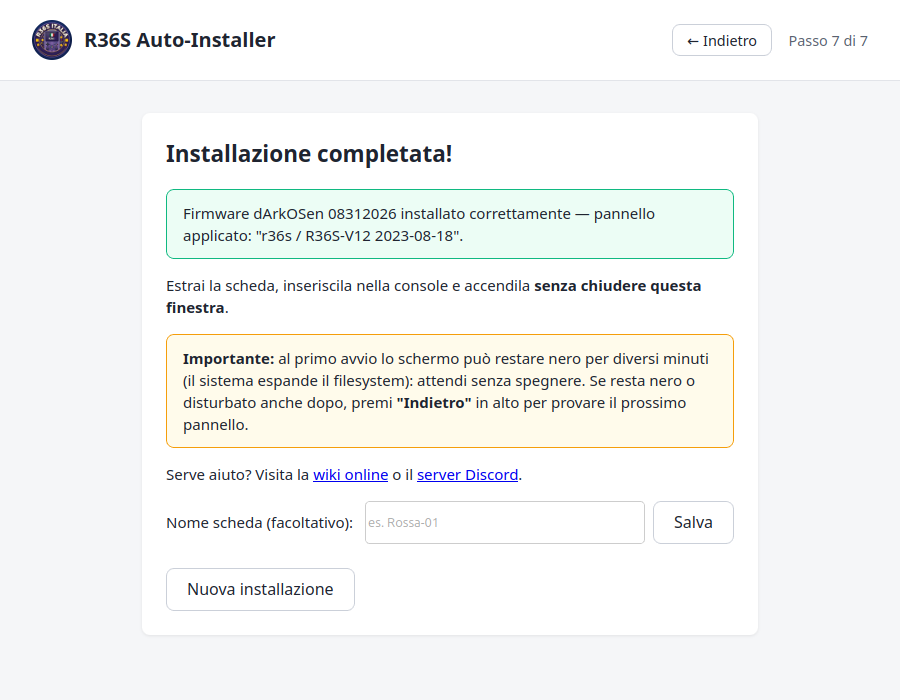

# R36S Auto-Installer

**R36S Auto-Installer** è un programma gratuito per Windows che automatizza l'installazione del firmware **dArkOSen** sulla tua console R36S. Ti guida passo per passo: scarica l'ultima versione da GitHub, prepara la scheda SD e copia i file corretti per il modello della tua scheda madre — **senza bisogno di usare il terminale o programmi tecnici**.

## ⬇️ Download

<!-- Il nome del file include la versione: aggiornare questo link ad ogni nuova release pubblicata. -->
**[Scarica l'ultima versione](https://github.com/chrisdaloa/R36S-Autoinstaller-releases/releases/download/v0.1.1/R36S.Auto-Installer_0.1.1_x64-setup.exe)** — link diretto all'eseguibile, senza passare dalla pagina Releases.

> Questo repository contiene solo gli eseguibili pronti per il download. Il codice sorgente del progetto vive in un repository separato. La pagina [Releases](https://github.com/chrisdaloa/R36S-Autoinstaller-releases/releases) elenca anche un installer `.msi` alternativo e un file `latest.json` (usato solo internamente dal programma per controllare gli aggiornamenti, non va scaricato a mano).

> **Prima di iniziare:** ti serve un lettore di schede SD (interno o USB), una scheda SD **vuota o già formattata** di almeno 8 GB, e una connessione internet per il download del firmware (circa 2-3 GB).

> **Disclaimer:** questo strumento viene fornito così com'è, senza alcuna garanzia. L'uso è a proprio rischio: l'autore non si assume alcuna responsabilità per eventuali danni alla console, alla scheda SD o ad altri dispositivi derivanti dall'uso di questo programma.

### ⚠️ Prima di avviare il programma

- **Avvia il programma come amministratore** (tasto destro sull'eseguibile → **Esegui come amministratore**): serve per poter scrivere sulla scheda SD/USB, altrimenti la scrittura fallisce.
- **Windows potrebbe mostrare un avviso di sicurezza all'avvio** ("Windows ha protetto il PC" / SmartScreen), perché il programma non è firmato con un certificato a pagamento. È normale per un programma gratuito distribuito così: clicca su **Informazioni aggiuntive** e poi su **Esegui comunque** per procedere.

---

## Step 0 — Benvenuto

All'avvio del programma trovi una breve introduzione, un link al progetto originale dArkOSen e i link alla community italiana (wiki online e server Discord) per chiedere aiuto in caso di problemi.

Premi **Inizia** per procedere.

---

## Step 1 — Scarica il firmware

Il programma controlla automaticamente su GitHub qual è l'ultima versione disponibile del firmware dArkOSen e mostra i file da scaricare con la relativa dimensione.

- Puoi cambiare la cartella di download con **Cambia cartella...** se vuoi salvare i file altrove.
- Se una versione è già stata scaricata in precedenza nella stessa cartella, il programma se ne accorge e ti permette di procedere direttamente senza riscaricarla, oppure di scaricarla di nuovo.
- Premi **Continua** quando il download è terminato.

---

## Step 2 — Estrazione dell'archivio

Il firmware viene scaricato come archivio compresso in più parti (`.7z.001`, `.7z.002`, ...). Il programma lo estrae automaticamente per ottenere l'immagine del sistema operativo da scrivere sulla scheda SD.

Una barra di avanzamento mostra la percentuale completata. Al termine, premi **Continua**.

---

## Step 3 — Scegli la scheda SD

Inserisci la scheda SD nel lettore. Il programma elenca solo i dischi rimovibili (SD/USB) e **non permette mai di selezionare il disco di sistema** del computer, per sicurezza.

> **Consiglio:** se la scheda è già stata usata in precedenza (per un'altra console, un Raspberry Pi, un PC...), formattala completamente prima di selezionarla, per evitare problemi di riconoscimento durante l'installazione.

Seleziona la tua scheda dall'elenco (verifica che dimensione e nome corrispondano alla tua SD) e premi **Continua**. Se la scheda non compare, usa **Aggiorna elenco** dopo averla inserita.

---

## Step 4 — Scrittura sulla scheda SD

Questo è il passaggio che **cancella definitivamente** tutto il contenuto della scheda SD selezionata, per scriverci il nuovo firmware. Per sicurezza, il programma chiede una conferma esplicita prima di procedere.

Spunta la casella di conferma (mostra il nome e la dimensione della scheda selezionata, controlla che siano quelli giusti) per abilitare il pulsante **Scrivi sulla scheda SD**.

Durante la scrittura reale su una scheda fisica vedrai una barra di avanzamento con **percentuale, velocità (MB/s) e tempo stimato rimanente**. La scrittura di un'immagine di alcuni GB può richiedere diversi minuti, soprattutto con lettori SD lenti: **non chiudere il programma e non rimuovere la scheda durante la scrittura**, potresti danneggiarla.

Al termine, premi **Continua**.

---

## Step 4 (verifica) — Reinserisci la scheda SD

Dopo la scrittura, il programma chiede di **estrarre e reinserire la scheda SD**: serve perché il sistema operativo del computer veda correttamente il contenuto appena scritto (un limite noto di Windows e di alcuni lettori SD, non un problema del firmware).

Estrai la scheda, attendi qualche secondo, reinseriscila e premi **Ho reinserito la scheda, verifica**. Il programma controlla che la scheda contenga davvero i file appena scritti prima di lasciarti proseguire.

---

## Step 5 — Riconoscimento del modello di scheda (opzionale)

Ogni scheda madre R36S usa un file di configurazione grafica (**pannello DTB**) leggermente diverso, e non è possibile riconoscerlo automaticamente dal software: va individuato per tentativi, oppure recuperato da un vecchio backup.

- Se hai un file `.dtb` di backup preso dalla tua vecchia scheda SD, puoi selezionarlo con **Scegli file DTB...** per provare a riconoscere automaticamente il modello.
- Altrimenti premi **Salta, procedi manualmente** per scegliere il pannello a mano nello step successivo.

---

## Step 6 — Trova il pannello giusto per la tua scheda

Il programma legge i pannelli disponibili nel firmware appena scritto e ne suggerisce uno per iniziare.

- Se hai già usato questo strumento su questa scheda in passato, puoi usare **Recupera il pannello noto** per riapplicare direttamente quello che avevi già trovato funzionante.
- Altrimenti conferma il pannello suggerito (o scegline un altro dal menu a tendina) e premi **Continua** per applicarlo e testarlo sulla console.

Non preoccuparti se il primo pannello scelto non è quello giusto: dallo step successivo potrai tornare indietro e provarne un altro finché lo schermo della console non funziona correttamente.

---

## Step 7 — Installazione completata

Il pannello scelto viene applicato e il programma conferma che l'installazione è terminata.

Leggi con attenzione l'avviso sul primo avvio: **lo schermo della console può restare nero o mostrare solo un cursore per diversi minuti** al primo avvio, mentre il sistema espande il filesystem — è normale, non spegnere la console e attendi.

Se dopo l'attesa lo schermo resta nero o disturbato, significa che il pannello scelto non è quello giusto per la tua scheda madre: spegni la console, reinserisci la SD nel lettore, premi **"Indietro"** in alto nel programma e prova il pannello successivo dall'elenco (Step 6).

Se vuoi, puoi dare un nome alla scheda (es. "Rossa-01"): la prossima volta che la userai con questo programma, il pannello funzionante verrà ricordato e riproposto automaticamente, senza doverlo ritrovare da capo.

---

## Serve aiuto?

Se qualcosa non funziona come previsto, visita la [wiki online della community](https://pixelpocket.1612.it/r36s) o chiedi supporto nel [server Discord](https://discord.gg/tusqNhr2V).
